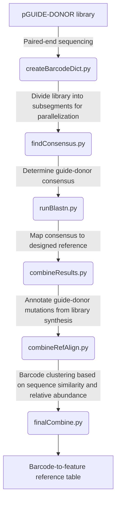

# MAGESTIC library mapping and annotation pipeline

Pipeline purpose: to process pair-end reads of barcode-guide-donor Step 1 cassette and generate a library reference table mapping barcodes to features.

### Introduction

These scripts are currently designed to use MAGESTIC library paired-end sequencing data for:
1. mapping barcodes to designed guide-donor pairs, and
2. identifying synthesis mutation errors in the guide-donor sequence.

During this process, an effort is made to improve library quality by clustering barcodes. This is accomplished using the criteria of sequence similarity and relative abundance.

The library design used as a model during pipeline development was:
- 31 nt pseudo-randomized barcode
- 110 nt donor sequence
- 11 nt BspQI restriction enzyme cut site
- 20 nt guide sequence

The paired-end design used as a model during pipeline development is as follows:
- 151 bp "forward read" with the barcode + donor sequence + BspQI cut site
- 151 bp "reverse read" with the guide + BspQI cut site + partial donor sequence

Although these were the intended designed, the pipeline is somewhat adaptable for future library designs, and efforts are in progress to make it even more flexible in future iterations.

### Dependencies

In order to execute this pipeline, an installed copy of BLASTN is required and must be used to create a database mapping designed features to their corresponding guide-donor sequences. This can be done by following the steps below:

1. Create a library design FASTA file with the following format:
	```
	>chrX_18819_TCA_to_GCC_PAM_18817_linked_2.1:PAM_disruption_or_1_to_5_bp_from_PAM_disruption
	GCTATAACGGGCCAAGTGACgtttgaagagcATGCAATAATGGGGTCTGCTTGCAGATGGTATAATCTGCTATAACGGGCCAAGGGCCAGGCACGCTGTTGCAGAACATACCATCTTATATCATGTAGGTTGTGCAAACA
	>chrX_18819_TCA_to_GCC_PAM_18823_+_linked_3.1:PAM_disruption_or_1_to_5_bp_from_PAM_disruption
	GCAACAGCGTGCCTGTCACTgtttgaagagcTGTTTGCACAACCTACATGATATAAGATGGTATGTTCTGCAACAGCGTGCCTGGCCCTTGGCCCGTTATAGCAGATTATACCATCTGCAAGCAGACCCCATTATTGCAT
	>chrX_24374_CTGC_to_TTGT_PAM_24378_+_linked_2.1:PAM_disruption_or_1_to_5_bp_from_PAM_disruption
	TCTTCCTTCCCATGGCTGCAgtttgaagagcTTTATGTTAAATGTGCTCGTTACTTCAACAAGTAAAGTCTTCCTTCCCATGGTTGTAAGGTGCGGGAATCACCATTTGAGTTTGCATAGTTGCCAAAAAACATGGTGTA
	```
where the sequence headers are the feature descriptors and the sequence itself is the guide-donor sequence expected from the paired-end reads.

2. A library database must the be generated using the library design file and the ```makeblastdb``` command from BLASTN.
	```
	./makeblastdb -in [LIBRARY_DESIGN_FILE] 
			-dbtype nucl 
			-out [DATABASE_NAME]
	```

3. Finally, either a direct or symbolic link to the ```runblastdb``` package must be in the working directory, so that BLASTN alignments can be performed using your generated library database and the alignment sequences.

For each new library developed, this process will need to be repeated, and the Snakefile described below will need to be updated to include information relevant to that specific library.

### Simple execution

To execute the barcode-to-feature mapping and annotation pipeline in a relatively straightforward and manner, use the included Snakemake execution pipeline.



To run the Snakemake pipeline:
1. Modify pipeline parameters as desired in the Snakefile
2. Execute on cluster via the command: ```nohup ./snakemake.sh &```

### Scripts

Below is an overview of each script in the pipeline, with information on which parameters can be specified for each step of the process.

#### Step 1: createBarcodeDict.py

Create dictionaries mapping barcodes to forward and reverse reads, split into sub-segments.

```
python createBarcodeDict.py --help
usage: createBarcodeDict.py [-h] -f FORWARD_FILES [FORWARD_FILES ...]
				 -r REVERSE_FILES [REVERSE_FILES ...] 
				 -s TOTAL_SEGMENTS 
				 -o OUT 
				 [-c CUTOFF] 
				 [-b BARCODE_LENGTH] 
				 [-bq BARCODE_QUALITY] 
				 [-gdq GUIDE_DONOR_QUALITY]
				 
optional arguments:
  -h, --help            show this help message and exit
  -f FORWARD_FILES [FORWARD_FILES ...], -forward FORWARD_FILES [FORWARD_FILES ...]
                        forward sequencing files
  -r REVERSE_FILES [REVERSE_FILES ...], -reverse REVERSE_FILES [REVERSE_FILES ...]
                        reverse sequencing files
  -s TOTAL_SEGMENTS, -segments TOTAL_SEGMENTS
                        number of segments to split job into
  -o OUT, -out OUT      keyword for saving output files
  -c CUTOFF, -cutoff CUTOFF
                        read count cutoff for barcodes to keep (default=0)
  -b BARCODE_LENGTH, -barcode BARCODE_LENGTH
                        length of barcode (default=31)
  -bq BARCODE_QUALITY, -bquality BARCODE_QUALITY
                        ascii quality score cutoff for barcode (default=53)
  -gdq GUIDE_DONOR_QUALITY, -gdquality GUIDE_DONOR_QUALITY
                        ascii quality score cutoff for guide-donor (default=55)
```

Returns:
- R1_dict: map barcodes to corresponding R1 sequences.
- R2_dict: map barcodes to corresponding R2 sequences.
- read_count_dict: map each barcode to corresponding total number of reads.

#### Step 2:  findConsensus.py

Find consensus guide-donor sequence for each barcode and store in output FASTA file.

```
python findConsensus.py --help
usage: findConsensus.py [-h] -r1 R1_DICT 
				-r2 R2_DICT 
				-o OUT 
				-s SEGMENT 
				-ts TOTAL_SEGMENTS 
				[-flength FORWARD_LENGTH] 
				[-rlength REVERSE_LENGTH] 
				[-th THRESHOLD]

optional arguments:
  -h, --help            show this help message and exit
  -r1 R1_DICT, -forward R1_DICT
                        dictionary of barcodes to forward reads
  -r2 R2_DICT, -reverse R2_DICT
                        dictionary of barcodes to reverse reads
  -o OUT, -out OUT      keywords to save output files under
  -s SEGMENT, -segment SEGMENT
                        segment number being processed
  -ts TOTAL_SEGMENTS, -total TOTAL_SEGMENTS
                        total number of segments being processed
  -flength FORWARD_LENGTH
                        length of forward read to use in finding consensus
                        (default=50)
  -rlength REVERSE_LENGTH
                        length of reverse read to use in finding consensus
                        (default=None)
  -th THRESHOLD, -threshold THRESHOLD
                        threshold for finding a consensus guide_donor sequence
                        (default=0.50)
```

Returns:
- results: FASTA file with the consensus sequence for each barcode and corresponding guide-donor sequence.

#### Step 3: runBlast.py

Map guide-donor consensus sequences to design file using BLAST database, annotate library synthesis errors.

```
python runBlastn.py --help
usage: runBlastn.py [-h] -in FILENAME 
			-db DATABASE 
			-p DATA_FILE

optional arguments:
  -h, --help    show this help message and exit
  -in FILENAME  input filename
  -db DATABASE  blast database to use
  -p DATA_FILE  reference plasmid data file (SK1.txt, RM11.txt, etc)
```

```DATA_FILE``` should be in fasta format, where the headers are the designed variant names and the sequences are the corresponding designed guide-donor
```DATABASE``` should be a BLAST database derived from ```DATA_FILE``` and created using the ```makeblastdb``` command.

Returns:
- df: Mapped but incomplete reference table for current segment of barcodes.

#### Step 4: combineResults.py

Join all reference table information for individual segments, add read count information and guide/donor status annotations.

```
python combineResults.py --help
usage: combineResults.py [-h] -f FILES [FILES ...] 
				-c COUNT_FILE 
				-l LIBRARY 
				-s SEGS

optional arguments:
  -h, --help            show this help message and exit
  -f FILES [FILES ...]  mapped segment files
  -c COUNT_FILE         count dict
  -l LIBRARY			name of library
  -s SEGS				number of segments to combine
```

Returns:
- df: uncollapsed reference table mapping barcodes to features.

#### Step 5: combineRefAlign.py

Cluster barcodes based on sequence similarity and relative abundances.

```
python combineRefAlign.py --help
usage: combineRefAlign.py [-h] -in FILE 
				-cutoff CUTOFF 
				-segment SEGMENT
	            -total_segments TOTAL_SEGMENTS

optional arguments:
  -h, --help            show this help message and exit
  -in FILE              input reference table for barcode clustering
  -cutoff CUTOFF        read count cutoff between low and high read barcodes
  -segment SEGMENT      current segment to process
  -total_segments TOTAL_SEGMENTS
                        total number of segments to divide into
```

Results:
- new_df: data frame containing information on sequence distances for collapsed barcodes
- clusters: low-read barcodes dictionary indicated which barcodes should be clustered

#### Step 6: finalCombine.py

Join all clustered barcode information for individual segments and create a clustered, collapsed library reference table.

```
python finalCombine.py --help
usage: finalCombine.py [-h] -in FILES [FILES ...] 
				-final FINAL_FILE

optional arguments:
  -h, --help            show this help message and exit
  -in FILES [FILES ...]
                        mapped cluster dictionaries
  -final FINAL_FILE     combine results file for subpool
```

Results:
- ref_table: final, collapsed reference table mapping barcodes to features.

